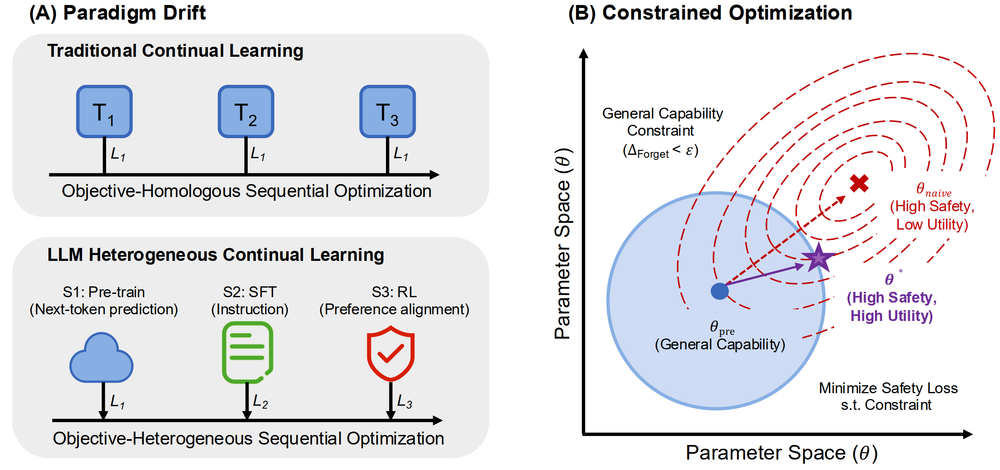
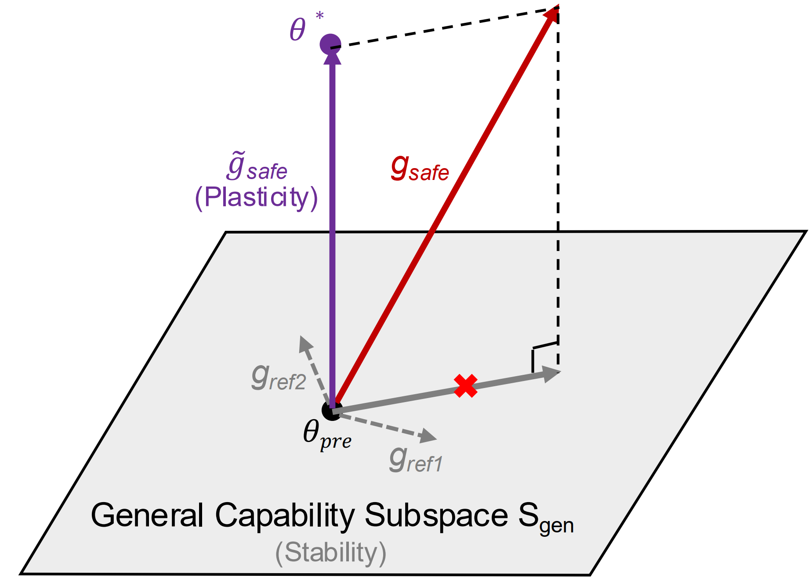
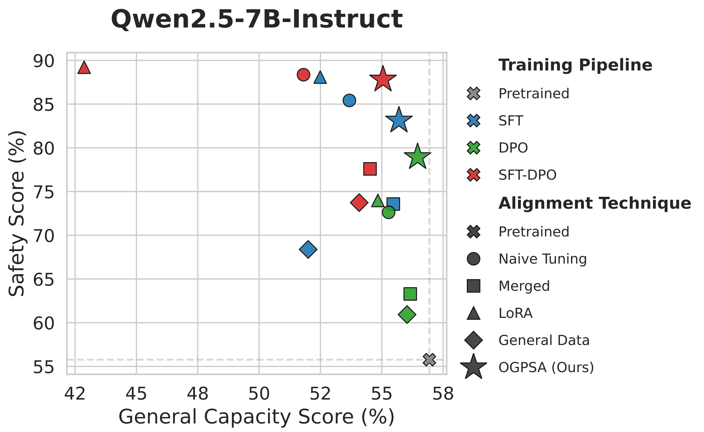

# OGPSA: Orthogonal Gradient Projection for Safety Alignment

Official PyTorch implementation of our paper for **safety alignment**.

<p align="center">
  <a href="https://arxiv.org/abs/2602.07892"></a>
  <a href="https://github.com/SunGL001/OGPSA"></a>
  <a href="LICENSE"></a>
</p>


**OGPSA** (**O**rthogonal **G**radient **P**rojection for **S**afety **A**lignment) preserves general capabilities during safety alignment via an orthogonal gradient projection strategy, balancing safety with downstream performance.


<p align="center">
  
</p>


<!-- <p align="center">
  
</p>

<p align="center">
  
</p> -->

<p align="center">
  
  &nbsp;&nbsp;&nbsp;&nbsp;
  
</p>


---

## Code Base & Environment

- **Code inheritance**: This repository is built on [LLaMA-Factory](https://github.com/hiyouga/LlamaFactory). We extend its training pipeline with OGPSA-specific stages and arguments.
- **Environment**: Set up your environment **exactly as in LLaMA-Factory** (no separate dependency stack).  
  Install the same Python, PyTorch/CUDA, and `requirements.txt` as in LLaMA-Factory; then you can run `llamafactory-cli` from this repo root.

---

## Installation

Requirements match LLaMA-Factory. Recommended steps:

1. **Python**: 3.10+
2. **PyTorch / CUDA**: Follow the [official PyTorch guide](https://pytorch.org/) for your CUDA version.
3. **Dependencies**: Install packages from `requirements.txt` (same as LLaMA-Factory).

Example:

```bash
# Using conda
conda create -n ogpsa python=3.10
conda activate ogpsa
pip install -U pip
pip install -r requirements.txt

# Or using venv
python -m venv .venv
source .venv/bin/activate   # Windows: .venv\Scripts\activate
pip install -U pip
pip install -r requirements.txt
```

If you already have an environment set up for LLaMA-Factory elsewhere, you can use that same environment and run `llamafactory-cli` from this project root.

---

## How to Run OGPSA

OGPSA safety alignment has two stages: **SFT** (`sft_pg`) and **DPO** (`dpo_pg`). Replace every `[your path]` with your model path, dataset path, output path, and DeepSpeed config path.

### Stage 1: Safety Alignment (SFT with Orthogonal Projection)

Post-pretrain and safety-align the backbone using orthogonal gradient projection:

```bash
llamafactory-cli train \
    --stage sft_pg \
    --do_train True \
    --model_name_or_path [your path] \
    --preprocessing_num_workers 16 \
    --finetuning_type full \
    --template qwen \
    --flash_attn auto \
    --dataset_dir [your path] \
    --dataset saferlhf2_sft \
    --cutoff_len 2048 \
    --learning_rate 1e-06 \
    --num_train_epochs 3.0 \
    --max_samples 100000 \
    --per_device_train_batch_size 4 \
    --gradient_accumulation_steps 4 \
    --lr_scheduler_type cosine \
    --max_grad_norm 1.0 \
    --logging_steps 5 \
    --save_only_model True \
    --save_strategy epoch \
    --warmup_steps 0 \
    --report_to none \
    --output_dir [your path] \
    --bf16 True \
    --plot_loss True \
    --trust_remote_code True \
    --ddp_timeout 180000000 \
    --include_num_input_tokens_seen True \
    --optim adamw_torch \
    --base_dataset ultrafeedback_sft_200,halueval_sft_200 \
    --base_num_samples 200 \
    --base_num_steps 30 \
    --base_method orthogonal_projection \
    --base_threshold 0 \
    --deepspeed [your path]/ds_z2_config.json
```

### Stage 2: DPO with Orthogonal Projection

Run DPO on safety data while keeping orthogonal projection to protect general capabilities:

```bash
llamafactory-cli train \
    --stage dpo_pg \
    --do_train True \
    --model_name_or_path [your path] \
    --preprocessing_num_workers 16 \
    --finetuning_type full \
    --template qwen \
    --flash_attn auto \
    --dataset_dir [your path] \
    --dataset saferlhf2_dpo \
    --cutoff_len 2048 \
    --learning_rate 1e-06 \
    --num_train_epochs 1.0 \
    --max_samples 100000 \
    --per_device_train_batch_size 2 \
    --gradient_accumulation_steps 16 \
    --lr_scheduler_type cosine \
    --max_grad_norm 1.0 \
    --logging_steps 5 \
    --save_only_model True \
    --warmup_steps 0 \
    --report_to none \
    --output_dir [your path] \
    --bf16 True \
    --plot_loss True \
    --trust_remote_code True \
    --ddp_timeout 180000000 \
    --include_num_input_tokens_seen True \
    --optim adamw_torch \
    --deepspeed [your path]/ds_z2_config.json \
    --pref_beta 0.2 \
    --pref_loss sigmoid \
    --base_dataset ultrafeedback_dpo \
    --base_num_samples 200 \
    --base_num_steps 5 \
    --base_method orthogonal_projection \
    --base_threshold 0
```

---

## Key Arguments

| Argument | Description |
|----------|-------------|
| `--stage` | `sft_pg`: SFT + orthogonal projection; `dpo_pg`: DPO + orthogonal projection |
| `--base_dataset` | Base dataset(s) used to build the orthogonal projection (preserves general capability) |
| `--base_num_samples` | Number of samples from the base dataset |
| `--base_num_steps` | Step-related control for the base gradient |
| `--base_method` | Set to `orthogonal_projection` for OGPSA |
| `--base_threshold` / `--base_scale` | Threshold and scale for the orthogonal projection |

Other training hyperparameters (learning rate, batch size, DeepSpeed, etc.) follow LLaMA-Factory and can be tuned as needed.

---

## Datasets & Directories

- `--dataset_dir`: Root directory for datasets (must contain `dataset_info.json` and the data files).
- `--dataset`: Use `saferlhf2_sft` for stage 1 and `saferlhf2_dpo` for stage 2.
- Base dataset names must match entries in `dataset_info.json` (e.g. `ultrafeedback_sft_200`, `halueval_sft_200`, `ultrafeedback_dpo`).

---

## Acknowledgements

This project extends the following open-source project:

- [LLaMA-Factory](https://github.com/hiyouga/LlamaFactory) — This codebase is inherited from LLaMA-Factory; please configure your environment as in LLaMA-Factory.

---

## Citation

If this repository helps your research, please cite our paper:

```bibtex
@misc{sun2026safetyalignmentcontinuallearning,
      title={Safety Alignment as Continual Learning: Mitigating the Alignment Tax via Orthogonal Gradient Projection}, 
      author={Guanglong Sun and Siyuan Zhang and Liyuan Wang and Jun Zhu and Hang Su and Yi Zhong},
      year={2026},
      eprint={2602.07892},
      archivePrefix={arXiv},
      primaryClass={cs.LG},
      url={https://arxiv.org/abs/2602.07892}, 
}
```
---

## License

See the `LICENSE` file in the project root.
